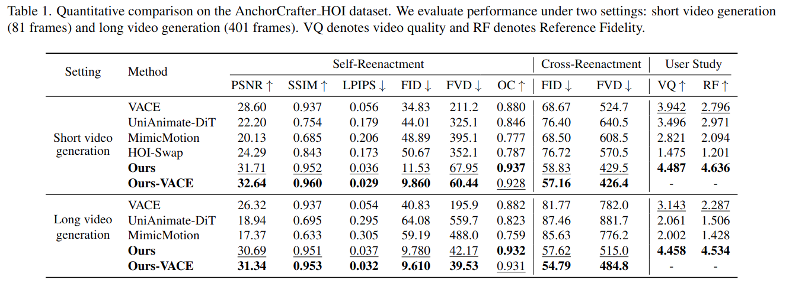

# GenHOI: Towards Object-Consistent Hand–Object Interaction with Temporally Balanced and Spatially Selective Object Injection

<p align="center">
  
</p>

This is the official repository for the paper [GenHOI: Towards Object-Consistent Hand–Object Interaction with Temporally Balanced and Spatially Selective Object Injection](https://arxiv.org/abs/2508.01488).

## 🚀 Update

- 🔥 **GenHOI-VACE Released!** Now available in the `vace` branch with significantly improved generalization performance. We recommend starting with this version.

## 🌿 Branch Information

This project contains **two branches** with different base models:

| Branch | Base Model | Description | Environment Reference |
|--------|------------|-------------|----------------------|
| **main** | [Wan2.1](https://github.com/Wan-Video/Wan2.1) | GenHOI based on Wan2.1-I2V-14B model | [Wan2.1 Installation](https://github.com/Wan-Video/Wan2.1#installation) |
| **vace** | [VACE](https://github.com/ali-vilab/VACE) | GenHOI based on vace model| [VACE Installation](https://github.com/ali-vilab/VACE#installation) |

### Switch Branch

```bash
# Use Wan2.1 based version (default)
git checkout main

# Use VACE based version
git checkout vace
```

The performance comparison between the two versions and existing methods is shown in the figure below.

> **⚠️ We strongly recommend that users start with the `vace` version due to its superior generalization capability.**
  
The corresponding code and detailed instructions can be found in the `vace` branch.


<p align="center">
  
</p>

Below, we introduce how to start the `Wan-based GenHOI`. 

<!-- ### Branch Comparison

| Feature | main (Wan2.1) | vace (VACE) |
|---------|---------------|-------------|
| Base Model | Wan2.1-I2V-14B-720P | Wan2.1-VACE-14B |
| Inference Script | `test_swap.py`, `test_selfswap.py` | `swap_infer.py`, `selfswap_infer.py` |
| Pipeline Class | `WanVideoPipelineRope` | `WanVideoPipeline` (VACE) |
| Additional Module | - | `wan_video_vace.py` |
| Control Enhancement | Standard | VACE-enhanced articulated control |

> **Note**: Please refer to the respective official repositories ([Wan2.1](https://github.com/Wan-Video/Wan2.1) / [VACE](https://github.com/ali-vilab/VACE)) for environment setup and dependencies. -->

## 📦 Environment Installation
We recommend follow the environment setting of  [Wan2.1](https://github.com/Wan-Video/Wan2.1) to install the environment dependencies.


## 📂 Model Weights

### Option 2: Manual Download from Hugging Face

Download model from: 🤗 [Hugging Face - GenHOI](https://huggingface.co/szlgallen/GenHOI)

Demo data and assets: 🤗 [Hugging Face - GenHOI-data](https://huggingface.co/datasets/szlgallen/GenHOI)


### Model Files Structure

After downloading, your `models/` directory should look like:

```
models/
├── Wan2.1-I2V-14B-720P/           # Base model (~28GB)
│   ├── diffusion_pytorch_model-00001-of-00007.safetensors
│   ├── diffusion_pytorch_model-00002-of-00007.safetensors
│   ├── diffusion_pytorch_model-00003-of-00007.safetensors
│   ├── diffusion_pytorch_model-00004-of-00007.safetensors
│   ├── diffusion_pytorch_model-00005-of-00007.safetensors
│   ├── diffusion_pytorch_model-00006-of-00007.safetensors
│   ├── diffusion_pytorch_model-00007-of-00007.safetensors
│   ├── models_clip_open-clip-xlm-roberta-large-vit-huge-14.pth
│   ├── models_t5_umt5-xxl-enc-bf16.pth
│   └── Wan2.1_VAE.pth
└── GenHOI_wan_flf.consolidated    # Fine-tuned weights (~2-5GB)
```

### Evaluation Models (Optional)

For running evaluation metrics (FVD, FID), download additional models ([Hugging Face - GenHOI](https://huggingface.co/szlgallen/GenHOI)) to `tools/eval_fvd/`:

```
tools/eval_fvd/
├── i3d_pretrained_400.pt      # I3D model for FVD (~50MB)
└── resnet-50-kinetics.pth     # ResNet-50 Kinetics (~100MB)
```
## 🚀 Quick Start

### Run Demo

```bash
python examples/wanvideo/test_swap.py \
    --model_path models/GenHOI_wan_flf.consolidated \
    --output_dir results/demo \
    --data_csv demo/demo.csv \
    --gpus 0 \
    --max_num_frames 81 \
    --is_fl
```

### Arguments

| Argument | Default | Description |
|----------|---------|-------------|
| `--model_path` | `models/ckpt/first_frame_rope.consolidated` | Path to GenHOI checkpoint |
| `--output_dir` | `results/demo` | Output directory for generated videos |
| `--data_csv` | `demo/demo.csv` | Path to input data CSV file |
| `--gpus` | `0` | GPU indices (comma-separated, e.g., `0,1,2,3`) |
| `--max_num_frames` | `81` | Maximum frames to generate |
| `--is_fl` | `False` | Enable first-last frame mode |

### Multi-GPU Inference

For faster inference, use multiple GPUs:

```bash
python examples/wanvideo/test_swap.py \
    --model_path models/GenHOI_wan_flf.consolidated \
    --output_dir results/demo \
    --data_csv demo/demo.csv \
    --gpus 0,1,2,3 \
    --max_num_frames 401 \
    --is_fl
```

## 📈 Evaluation on Test Set

### Object Swap Task

Run evaluation on the object swap test set:

```bash
# 81 frames (short video)
python examples/wanvideo/test_swap.py \
    --model_path models/GenHOI_wan_flf.consolidated \
    --output_dir results/swap_81 \
    --data_csv data/long_video_swap/swap.csv \
    --gpus 2 \
    --max_num_frames 81 \
    --is_fl

# 401 frames (long video)
python examples/wanvideo/test_swap.py \
    --model_path models/GenHOI_wan_flf.consolidated \
    --output_dir results/swap_401 \
    --data_csv data/long_video_swap/swap_f16.csv \
    --gpus 3 \
    --max_num_frames 401
```

### Self-Swap Task

Run evaluation on the self-swap test set (AnchorCrafter benchmark):

```bash
# 81 frames (short video)
python examples/wanvideo/test_selfswap.py \
    --model_path models/GenHOI_wan_flf.consolidated \
    --output_dir results/selfswap_81 \
    --data_csv data/AnchorCrafter-400_405f/dataset_select_f50.csv \
    --gpus 2 \
    --max_num_frames 81 \
    --is_fl

# 401 frames (long video)
python examples/wanvideo/test_selfswap.py \
    --model_path models/GenHOI_wan_flf.consolidated \
    --output_dir results/selfswap_401 \
    --data_csv data/AnchorCrafter-400_405f/dataset_select_f16.csv \
    --gpus 3 \
    --max_num_frames 401
```

### Evaluate Results

After running inference, use the unified evaluation script to compute metrics:

```bash
# Usage: bash tools/batch_eval_unified.sh <base_dir> [sample_duration] [device]

# Evaluate 81-frame results
bash tools/batch_eval_unified.sh results/swap_81 81 cuda
bash tools/batch_eval_unified.sh results/selfswap_81 81 cuda

# Evaluate 401-frame results
bash tools/batch_eval_unified.sh results/swap_401 401 cuda
bash tools/batch_eval_unified.sh results/selfswap_401 401 cuda
```

The evaluation script computes the following metrics:

| Metric | Description |
|--------|-------------|
| **FVD** | Fréchet Video Distance (using 3D-ResNet50 and 3D-Inception). The default metric reported in the paper is calculated by the 3D Inception network.|
| **FID-VID** | Fréchet Inception Distance for video frames |
| **FID** | Fréchet Inception Distance (frame-level) |
| **PSNR** | Peak Signal-to-Noise Ratio |
| **SSIM** | Structural Similarity Index |
| **OC** | Object-CLIP similarity score |

Results are saved to `<base_dir>/all_metrics.json`.

> **Note:**  
> For both **Self-Reenactment** and **Cross-Reenactment**, all the metrics listed above will be calculated.  
> **However, for Cross-Reenactment, only FVD and FID are valid metrics.**
## 📊 Data Format

### Input CSV Structure

Create a CSV file with the following columns:

| Column | Description |
|--------|-------------|
| `video_path` | Path to source video |
| `obj_mask_path` | Path to object mask video (white mask on object region) |
| `input_path` | Path to video with replaced background/object |
| `ref_img` | Path to reference image of the target object |

Example `demo.csv`:
```csv
video_path,obj_mask_path,input_path,ref_img
demo/10/26_78/video.mp4,demo/10/26_78/mask.mp4,demo/10/26_78/video_replace.mp4,demo/10/26_78/ref_img.png
```

### Preparing Your Own Data

1. **Source Video** (`video_path`): Original video with human-object interaction
2. **Object Mask** (`obj_mask_path`): Binary mask video highlighting the object region (white: object, black: background)
3. **Replacement Video** (`input_path`): Video with the original object removed/replaced
4. **Reference Image** (`ref_img`): Clear image of the target object you want to insert

## 📁 Output Structure

Generated results are saved in the specified output directory:

```
results/demo/
└── sample_0000_allclips/
    ├── all_generated.mp4      # Final generated video
    ├── all_control.mp4        # Control replacement result
    ├── all_gt.mp4             # Ground truth video
    ├── all_ref.mp4            # Reference 
```

## 🔧 Advanced Configuration

### Video Resolution

The default generation resolution is **720×1280** (portrait mode). Modify the pipeline parameters in `test_swap.py` if needed:

```python
video, video_control, video_gt, video_ref, latents_hand_pose, video_replaced = pipe(
    ...
    height=1280,
    width=720,
    ...
)
```

### Inference Steps

Adjust generation quality vs. speed trade-off:

```python
num_inference_steps=50  # Higher = better quality, slower
```

<!-- ## 🏗️ Project Structure

```
GenHOI/
├── diffsynth/                    # Core diffusion synthesis library
│   ├── models/                   # Model implementations
│   ├── pipelines/                # Generation pipelines
│   ├── schedulers/               # Noise schedulers
│   └── prompters/                # Text prompt processors
├── examples/
│   └── wanvideo/
│       ├── dataset/              # Dataset utilities
│       ├── test_swap.py          # Main inference script
│       └── test_selfswap.py      # Self-swap testing
├── models/                       # Model weights directory
├── demo/                         # Demo data and examples
└── requirements.txt
``` -->

## 📖 Citation

If you find this work useful, please consider citing:

```bibtex
@article{genhoi2025,
  title={GenHOI: Generalizable Human-Object Interaction Video Generation},
  author={},
  journal={},
  year={2025}
}
```

## 🙏 Acknowledgements

This project is built upon:
- [Wan2.1](https://github.com/Wan-Video/Wan2.1) - Base video generation model
- [DiffSynth-Studio](https://github.com/modelscope/DiffSynth-Studio) - Diffusion synthesis framework

## 📄 License

This project is released under the [Creative Commons Attribution Non Commercial 4.0](LICENSE).


---

<p align="center">
  <b>⭐ Star us on GitHub if you find this project useful!</b>
</p>