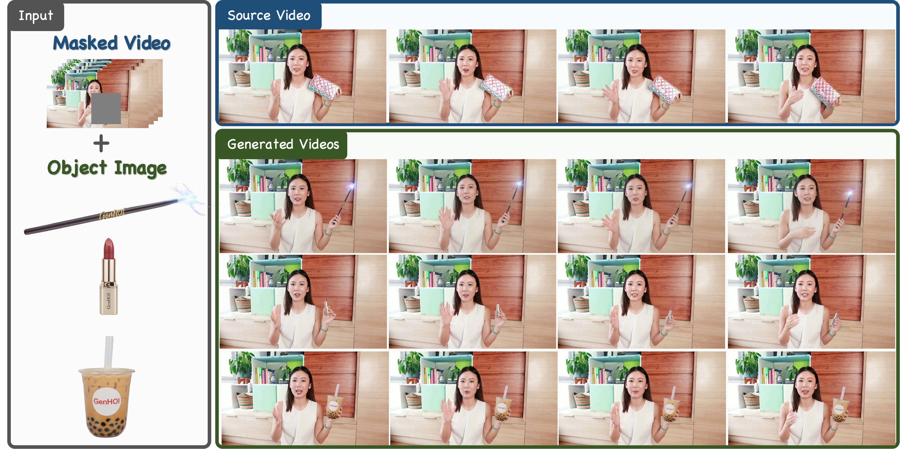

# GenHOI: Towards Object-Consistent Hand–Object Interaction with Temporally Balanced and Spatially Selective Object Injection

<p align="center">
  
</p>

This is the official repository for the paper [GenHOI: Towards Object-Consistent Hand–Object Interaction with Temporally Balanced and Spatially Selective Object Injection](https://arxiv.org/abs/2508.01488).

<!-- ## ✨ Features

- **Generalizable Object Swapping**: Replace objects in videos while maintaining natural hand-object interactions
- **High-Quality Video Generation**: Based on Wan2.1-I2V-14B model for photorealistic results
- **Flexible Frame Control**: Support for variable frame lengths (up to 400+ frames)
- **Multi-GPU Inference**: Distributed processing for efficient generation
- **Fine-grained Control**: Object mask and reference image guided generation -->

## 🌿 Branch Information

This project contains **two branches** with different base models:

| Branch | Base Model | Description | Environment Reference |
|--------|------------|-------------|----------------------|
| **main** | [Wan2.1](https://github.com/Wan-Video/Wan2.1) | GenHOI based on Wan2.1-I2V-14B model | [Wan2.1 Installation](https://github.com/Wan-Video/Wan2.1#installation) |
| **vace** | [VACE](https://github.com/ali-vilab/VACE) | GenHOI based on vace model| [VACE Installation](https://github.com/ali-vilab/VACE#installation) |

### Switch Branch

```bash
# Use Wan2.1 based version (default)
git checkout main

# Use VACE based version
git checkout vace
```

**Below, we introduce how to start the VACE-based GenHOI. We highly recommend using the VACE-based version for better performance. For instructions on the WAN-based GenHOI, please refer to the README file in the corresponding branch.**

### Installation
Please refer to [Wan2.1-VACE](https://github.com/ali-vilab/VACE) for the environment installation instructions.
## 📦 Model Weights

### Base Model

Download Wan2.1-VACE-14B base model from HuggingFace:

```bash
# Download using modelscope or huggingface-cli
huggingface-cli download Wan-AI/Wan2.1-VACE-14B --local-dir models/Wan2.1-VACE-14B
```

### GenHOI Weights
Download model from: 🤗 [Hugging Face - GenHOI](https://huggingface.co/szlgallen/GenHOI)

Place GenHOI fine-tuned weights in the `models/GenHOI_VACE/` directory:

| Filename | Description |
|--------|------|
| `step-5000-gate_attn.safetensors` | Gate Attention Weights |
| `step-1700-lora-gate-720.safetensors` | LoRA Weights (720p) |
| `step-1100-lora-gate-flf-720-2.safetensors` | First-Last Frame Mode LoRA Weights |

<!-- ### Evaluation Models (Optional)

For running evaluation metrics (FVD, FID), download additional models to `tools/eval_fvd/`:

```
tools/eval_fvd/
├── i3d_pretrained_400.pt      # I3D model for FVD (~50MB)
└── resnet-50-kinetics.pth     # ResNet-50 Kinetics (~100MB)
``` -->

## Evaluation dataset
Please download the corresponding evaluation dataset from [Hugging Face - GenHOI-data](https://huggingface.co/datasets/szlgallen/GenHOI)

## 🚀 Quick Start
We provide a quick start demo included in this repository. To run on our full evaluation dataset, simply download the dataset from Hugging Face and change the `data_csv` argument to `data/long_video_swap/swap.csv` (from the downloaded evaluation dataset).
### Self-Swap(Reconstruct)
```bash
python examples/wanvideo/selfswap_infer.py \
    --output_dir results/selfswap_demo \
    --data_csv demo/demo.csv \
    --gpus 0 \
    --max_num_frames 81 \
    --model_path models/GenHOI_VACE/step-5000-gate_attn.safetensors \
    --lora_path models/GenHOI_VACE/step-1700-lora-gate-720.safetensors
```

### Object-Swap

```bash
python examples/wanvideo/swap_infer.py \
    --output_dir results/swap_demo \
    --data_csv demo/demo.csv \
    --gpus 0 \
    --max_num_frames 81 \
    --model_path models/GenHOI_VACE/step-5000-gate_attn.safetensors \
    --lora_path models/GenHOI_VACE/step-1700-lora-gate-720.safetensors
```

### Enable First-Last Frame Mode
you can just add `--is_fl` argument to enable the FLF mode
```bash
python examples/wanvideo/selfswap_infer.py \
    --output_dir results/selfswap_flf \
    --data_csv demo/demo.csv \
    --gpus 0,1,2,3 \
    --max_num_frames 401 \
    --model_path models/GenHOI_VACE/step-5000-gate_attn.safetensors \
    --lora_path models/GenHOI_VACE/step-1100-lora-gate-flf-720-2.safetensors \
    --is_fl
```

### Arguments

| Argument | Description | Default |
|------|------|--------|
| `--output_dir` | Output directory | `results/` |
| `--data_csv` | Dataset CSV file path | - |
| `--gpus` | GPU indices to use, comma separated | `0,1,2,3` |
| `--max_num_frames` | Maximum number of frames | `81` |
| `--is_fl` | Enable First-Last Frame Mode | `False` |
| `--model_path` | Gate Attention model path | - |
| `--lora_path` | LoRA weights path | - |

### Evaluate Results

The evaluation code is provided in the `main` branch.

<strong style="color:red;">IMPORTANT: Please switch to the `main` branch before proceeding.</strong>

Please refer to the **Evaluation** section of the README in the `main` branch for detailed instructions.  Below, we provide a brief overview of the startup commands and supported evaluation metrics.


```bash
# Usage: bash tools/batch_eval_unified.sh <base_dir> [sample_duration] [device]

# Evaluate 81-frame results
bash tools/batch_eval_unified.sh results/swap_81 81 cuda
bash tools/batch_eval_unified.sh results/selfswap_81 81 cuda

# Evaluate 401-frame results
bash tools/batch_eval_unified.sh results/swap_401 401 cuda
bash tools/batch_eval_unified.sh results/selfswap_401 401 cuda
```

The evaluation script computes the following metrics:

| Metric | Description |
|--------|-------------|
| **FVD** | Fréchet Video Distance (using 3D-ResNet50 and 3D-Inception) |
| **FID-VID** | Fréchet Inception Distance for video frames |
| **FID** | Fréchet Inception Distance (frame-level) |
| **PSNR** | Peak Signal-to-Noise Ratio |
| **SSIM** | Structural Similarity Index |
| **OC** | Object-CLIP similarity score |

Results are saved to `<base_dir>/all_metrics.json`.

## 📊 Data Format

### Input CSV Structure

Create a CSV file with the following columns:

| Column | Description |
|--------|-------------|
| `video_path` | Path to source video |
| `obj_mask_path` | Path to object mask video (white mask on object region) |
| `input_path` | Path to video with replaced background/object |
| `ref_img` | Path to reference image of the target object |

Example `demo.csv`:
```csv
video_path,obj_mask_path,input_path,ref_img
demo/10/26_78/video.mp4,demo/10/26_78/mask.mp4,demo/10/26_78/video_replace.mp4,demo/10/26_78/ref_img.png
```

### Preparing Your Own Data

1. **Source Video** (`video_path`): Original video with human-object interaction
2. **Object Mask** (`obj_mask_path`): Binary mask video highlighting the object region (white: object, black: background)
3. **Replacement Video** (`input_path`): Video with the original object removed/replaced
4. **Reference Image** (`ref_img`): Clear image of the target object you want to insert

## 🙏 Acknowledgements

This project is based on the following open-source works:

- [Wan2.1-VACE](https://github.com/Wan-Video/Wan2.1) - Base video generation model
- [DiffSynth-Studio](https://github.com/modelscope/DiffSynth-Studio) - Inference framework

## 📄 License

This project is released under the [Creative Commons Attribution Non Commercial 4.0](LICENSE).